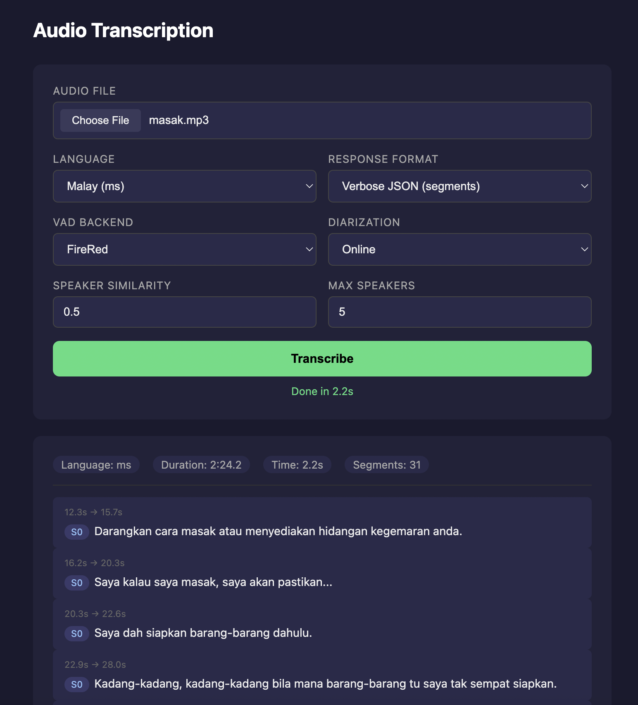
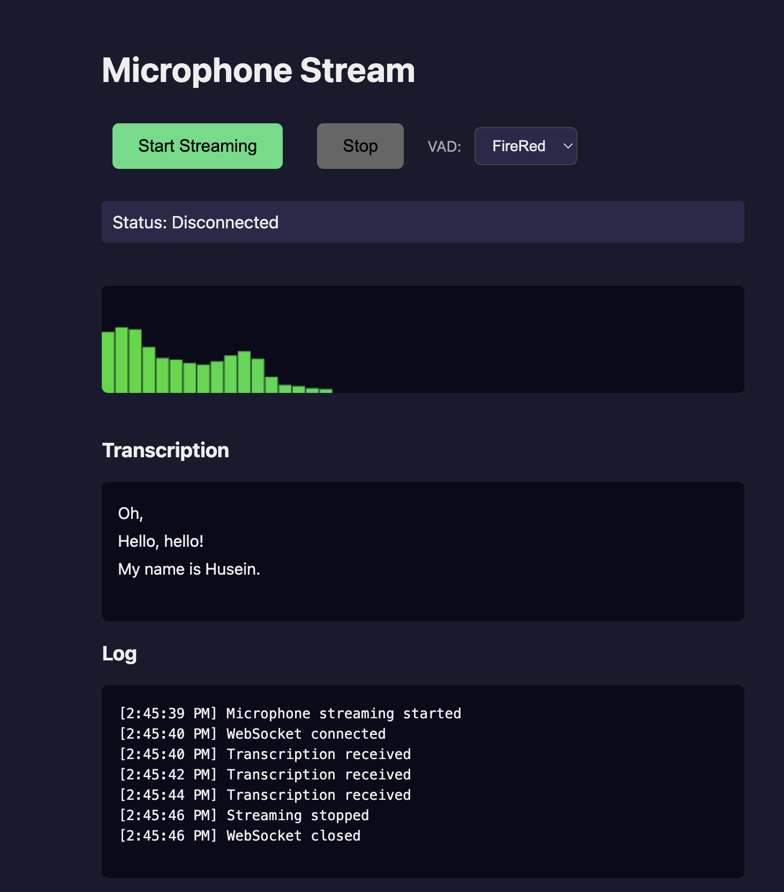

# STT-API

Long-form speech-to-text API that:

- **Chunks long audio** using VAD (Silero or FireRed) into manageable pieces
- **Keeps global timestamps** across all chunks
- **Transcribes chunks concurrently** for improved performance
- **Proxies to an upstream STT engine** via an OpenAI-compatible `/v1/audio/transcriptions` endpoint
- **Real-time WebSocket streaming** with per-client VAD and live transcription
- **Force alignment** for word-level timestamps using CTC alignment (MMS-300M) with dynamic batching
- **Speaker diarization** with online (TitaNet + StreamingKMeans) or offline (pyannote) modes

---

## Architecture

```
┌─────────────────────────────────────────────────────────────────────────┐
│                              Client Request                              │
│                         (audio file upload)                              │
└─────────────────────────────────────────────────────────────────────────┘
                                    │
                                    ▼
┌─────────────────────────────────────────────────────────────────────────┐
│                         FastAPI Endpoint                                 │
│                    POST /audio/transcriptions                            │
│              (request_semaphore: max 20 concurrent)                      │
└─────────────────────────────────────────────────────────────────────────┘
                                    │
                    ┌───────────────┴───────────────┐
                    ▼                               ▼
┌──────────────────────────────┐    ┌──────────────────────────────────────┐
│   PHASE 1: VAD Chunking      │    │         Audio Loading                │
│   (Parallel Processing)      │    │   librosa → 16kHz mono numpy         │
│                              │    └──────────────────────────────────────┘
│  ┌─────────────────────────┐ │
│  │  ProcessPoolExecutor    │ │
│  │  (VAD_WORKERS=8)        │ │
│  │                         │ │
│  │  Worker 1 ─► Silero VAD │ │
│  │  Worker 2 ─► Silero VAD │ │
│  │  ...                    │ │
│  │  Worker N ─► Silero VAD │ │
│  └─────────────────────────┘ │
│                              │
│  Output: List of chunks with │
│  timestamps & silence ratio  │
└──────────────────────────────┘
                    │
                    ▼
┌─────────────────────────────────────────────────────────────────────────┐
│                    PHASE 2: Transcription                                │
│                                                                          │
│   Filter chunks (skip if silence_ratio > reject_segment_vad_ratio)      │
│                                                                          │
│   ┌─────────────────────────────────────────────────────────────────┐   │
│   │  Batch Processing (CHUNK_BATCH_SIZE=8)                          │   │
│   │                                                                  │   │
│   │  Batch 1: [chunk1, chunk2, ... chunk8] ──► asyncio.gather()     │   │
│   │  Batch 2: [chunk9, chunk10, ...]        ──► asyncio.gather()    │   │
│   │  ...                                                             │   │
│   └─────────────────────────────────────────────────────────────────┘   │
│                              │                                           │
│                    ┌─────────┴─────────┐                                 │
│                    ▼                   ▼                                 │
│   ┌──────────────────────────┐  ┌─────────────────────────────────────┐ │
│   │  Upstream STT API Calls  │  │  Online Diarization (if enabled)    │ │
│   │  (upstream_semaphore:    │  │  (incremental, during transcription)│ │
│   │   max 100 concurrent)    │  │                                     │ │
│   │                          │  │  • Extract embeddings (batched)     │ │
│   │  transcribe_chunk() ──►  │  │  • Assign speakers incrementally   │ │
│   │  POST to STT_API_URL     │  │  • Reuse StreamingKMeansMaxCluster  │ │
│   │  (with timestamp adj.)   │  │                                     │ │
│   └──────────────────────────┘  └─────────────────────────────────────┘ │
└─────────────────────────────────────────────────────────────────────────┘
                                    │
                                    ▼
┌─────────────────────────────────────────────────────────────────────────┐
│                      Response Assembly                                   │
│                                                                          │
│   1. Combine all transcription texts                                     │
│   2. Parse timestamps into structured segments                           │
│   3. Return in requested format (text/json/verbose_json)                │
└─────────────────────────────────────────────────────────────────────────┘
```

### Processing Flow

1. **Ingest**: Client uploads audio to `POST /audio/transcriptions`
2. **VAD + Chunking**: Audio is processed through Silero VAD in parallel workers, split into chunks based on silence detection and max chunk length (25s)
3. **Concurrent Transcription**: Chunks are sent concurrently to upstream STT API with timestamp adjustment
4. **Online Diarization** (if enabled): Processes chunks incrementally during transcription:
   - Extracts speaker embeddings in small batches (default: 4 chunks)
   - Assigns speakers incrementally using StreamingKMeansMaxCluster
   - Maintains GPU batching efficiency while enabling true incremental processing
5. **Merge & Respond**: All transcriptions are merged with global timestamps and speaker assignments (if diarization enabled), then returned

### Concurrency Model

| Semaphore | Default | Purpose |
|-----------|---------|---------|
| `MAX_CONCURRENT_REQUESTS` | 20 | Limits full request processing (memory-heavy) |
| `MAX_CONCURRENT_UPSTREAM` | 100 | Limits concurrent upstream API calls (I/O-bound) |
| `VAD_WORKERS` | 8 | Process pool workers for VAD (CPU-bound) |
| `CHUNK_BATCH_SIZE` | 8 | Chunks per async transcription batch |

---

## API Endpoints

| Endpoint | Method | Description |
|----------|--------|-------------|
| `/` | GET | Health/version check |
| `/audio/transcriptions` | POST | Long audio transcription with VAD chunking |
| `/transcribe` | GET | Browser UI for POST transcription |
| `/streaming` | GET | Browser UI for WebSocket streaming |
| `/ws` | WebSocket | Real-time streaming transcription with VAD |
| `/force_align` | POST | Force alignment (word-level timestamps from audio + transcript) |

---

## Prerequisites

- Docker and Docker Compose
- External Docker network `stt-network`

---

## Quick Start

### 1. Create External Network

```bash
docker network create stt-network
```

### 2. Run vLLM

```bash
docker compose -f vllm.yaml up --detach
```

Or with a private model (create `.env_vllm` with `HUGGING_FACE_HUB_TOKEN=`):

```bash
STT_MODEL=openai/whisper-large-v3-turbo GPU_MEM_UTIL=0.7 \
docker compose -f vllm.yaml up --detach
```

### 3. Configure Environment (Optional)

Create a `.env` file:

```bash
STT_API_URL=http://stt-engine:9089
SAMPLE_RATE=16000
MAX_CHUNK_LENGTH=25
MINIMUM_SILENT_MS=400
MINIMUM_TRIGGER_VAD_MS=1500
REJECT_SEGMENT_VAD_RATIO=0.7
VAD_THRESHOLD=0.5
MINIMUM_SPEECH_MS=250
MAX_CONCURRENT_REQUESTS=20
VAD_WORKERS=8
```

### 4. Build and Run

```bash
docker compose up --build
```

The API will be available at `http://localhost:9091`.

### Running Without Docker

```bash
uv sync
uv run uvicorn stt_api.main:app --host 0.0.0.0 --port 9091
```

---

## Usage

### Basic Transcription

```bash
curl -X POST "http://localhost:9091/audio/transcriptions" \
  -F "file=@audio.mp3" \
  -F "language=en" \
  -F "response_format=json"
```

Or use the browser UI at `http://localhost:9091/transcribe`.



### Request Parameters

| Parameter | Type | Default | Description |
|-----------|------|---------|-------------|
| `file` | file | required | Audio file (multipart/form-data) |
| `language` | string | null | Language hint: `en`, `ms`, `zh`, `ta`, or `null` for auto-detect |
| `response_format` | string | json | Response format: `text`, `json`, or `verbose_json` |
| `vad` | string | silero | VAD backend: `silero` or `firered` |
| `vad_threshold` | float | 0.5 | Speech probability threshold (0.0–1.0) |
| `minimum_silent_ms` | int | 400 | Minimum silence duration to trigger a segment cut (ms) |
| `minimum_speech_ms` | int | 250 | Minimum speech detected before triggering transcription (ms) |
| `minimum_trigger_vad_ms` | int | 1500 | Minimum audio length before VAD can trigger (ms) |
| `reject_segment_vad_ratio` | float | 0.7 | Discard chunks where silence exceeds this ratio (0.0–1.0) |
| `diarization` | string | none | Diarization mode: `none`, `online`, or `offline` |
| `speaker_similarity` | float | 0.5 | Online mode: speaker clustering threshold (0.0–1.0) |
| `speaker_max_n` | int | 5 | Online mode: maximum number of speakers |

### Response Formats

**`json`** (default):
```json
{"text": "Transcribed text here..."}
```

**`verbose_json`**:
```json
{
  "language": "en",
  "duration": 144.94,
  "text": "Transcribed text here...",
  "segments": [
    {"id": 0, "start": 0.0,  "end": 3.68, "text": "First segment text."},
    {"id": 1, "start": 3.68, "end": 7.42, "text": "Second segment text."}
  ]
}
```

**`verbose_json` with diarization**:
```json
{
  "language": "en",
  "duration": 144.94,
  "text": "Hello there. Hi, how are you?",
  "segments": [
    {"id": 0, "start": 0.0,  "end": 3.68, "text": "Hello there.",    "speaker": 0},
    {"id": 1, "start": 3.68, "end": 7.42, "text": "Hi, how are you?", "speaker": 1}
  ]
}
```

**`text`**: Plain text string

---

## WebSocket Streaming

The `/ws` endpoint provides real-time streaming transcription. The client streams microphone audio over a WebSocket; the server runs VAD on incoming frames and transcribes speech segments as they are detected.

### How It Works

```
┌──────────────┐     float32 bytes      ┌───────────────────────────────────────┐
│   Browser     │ ─────────────────────► │  WebSocket /ws                        │
│   (mic @16k)  │                        │                                       │
│               │ ◄───────────────────── │  1. Buffer into numpy array           │
│  JSON results │     JSON messages      │  2. Split into 512-sample frames      │
└──────────────┘                        │  3. Run VAD (Silero or FireRed)        │
                                         │  4. Track silence / speech state       │
                                         │  5. On VAD trigger → transcribe_chunk  │
                                         │     (POST to upstream STT API)         │
                                         │  6. Send result back over WebSocket    │
                                         └───────────────────────────────────────┘
```

### Query Parameters

| Parameter | Type | Default | Description |
|-----------|------|---------|-------------|
| `language` | string | null | Language hint: `en`, `ms`, `zh`, `ta`, or `null` for auto-detect |
| `vad` | string | silero | VAD backend: `silero` or `firered` |
| `vad_threshold` | float | 0.5 | Speech probability threshold (0.0–1.0) |
| `minimum_silent_ms` | int | 400 | Minimum silence duration to trigger a segment cut (ms) |
| `minimum_speech_ms` | int | 250 | Minimum speech detected before triggering transcription (ms) |
| `minimum_trigger_vad_ms` | int | 1500 | Minimum audio length before VAD can trigger (ms) |
| `reject_segment_vad_ratio` | float | 0.7 | Discard chunks where silence exceeds this ratio (0.0–1.0) |

### Client Protocol

1. Connect to `ws://<host>/ws?language=en`
2. Send raw `Float32Array` audio bytes (16kHz, mono)
3. Receive JSON messages:

```json
// Transcription result
{"type": "transcription", "language": "en", "segments": [{"id": 0, "start": 0.0, "end": 3.5, "text": "Hello world."}]}

// Silent segment (skipped)
{"type": "silent"}

// Error
{"error": "error details"}
```

### Demo Page

Visit `http://localhost:9091/streaming` for a browser-based demo with microphone capture, audio visualizer, and live transcription display.



### JavaScript Example

```javascript
const ws = new WebSocket('ws://localhost:9091/ws?language=en');
ws.binaryType = 'arraybuffer';

const audioContext = new AudioContext({ sampleRate: 16000 });
const stream = await navigator.mediaDevices.getUserMedia({ audio: { sampleRate: 16000, channelCount: 1 } });
const source = audioContext.createMediaStreamSource(stream);
const processor = audioContext.createScriptProcessor(4096, 1, 1);

processor.onaudioprocess = (e) => {
    if (ws.readyState === WebSocket.OPEN)
        ws.send(new Float32Array(e.inputBuffer.getChannelData(0)).buffer);
};

source.connect(processor);
processor.connect(audioContext.destination);

ws.onmessage = (event) => {
    const data = JSON.parse(event.data);
    if (data.type === 'transcription') console.log(data.segments);
};
```

---

## Speaker Diarization

Optional speaker diarization to identify who is speaking in each segment.

### Modes

| Mode | Description | Speed | Accuracy |
|------|-------------|-------|----------|
| `none` | No speaker labels (default) | Fastest | N/A |
| `online` | TitaNet + StreamingKMeans (incremental during transcription) | Fast | Good |
| `offline` | External OSD service (pyannote) | Slow | Best |

### Online Diarization

Uses TitaNet Large for speaker embeddings with batched GPU inference and StreamingKMeansMaxCluster for incremental speaker assignment. Processes chunks during transcription (not after) for lower latency.

**Parameters:**
- `speaker_similarity`: Cosine similarity threshold (0.0–1.0). Higher = stricter matching, fewer speakers. Default: `0.5`
- `speaker_max_n`: Maximum speakers to detect. Default: `5`

### Offline Diarization

Calls an external OSD service running pyannote/speaker-diarization-3.1. More accurate but requires the OSD service to be running.

### Example

```bash
curl -X POST "http://localhost:9091/audio/transcriptions" \
  -F "file=@meeting.mp3" \
  -F "language=en" \
  -F "response_format=verbose_json" \
  -F "diarization=online" \
  -F "speaker_similarity=0.7" \
  -F "speaker_max_n=5"
```

---

## Force Alignment

The `/force_align` endpoint produces word-level timestamps by aligning a known transcript to audio using CTC forced alignment (MMS-300M model).

### How It Works

```
┌──────────────────────────────────────────────────────────────────────┐
│                         POST /force_align                            │
│                  (audio file + transcript + language)                 │
└──────────────────────────────────────────────────────────────────────┘
                                │
                                ▼
┌──────────────────────────────────────────────────────────────────────┐
│                      Dynamic Batching Queue                          │
│  step() loop:                                                        │
│    1. await first request                                            │
│    2. collect more within DYNAMIC_BATCHING_MICROSLEEP window         │
│    3. process batch (DYNAMIC_BATCHING_BATCH_SIZE, default: 8)       │
└──────────────────────────────────────────────────────────────────────┘
                                │
                    ┌───────────┴───────────┐
                    ▼                       ▼
┌────────────────────────────┐  ┌──────────────────────────────────────┐
│  GPU: Batch Emission       │  │  CPU: Postprocessing (parallel)      │
│  (ThreadPoolExecutor)      │  │  (ProcessPoolExecutor)               │
│                            │  │                                      │
│  1. librosa.load → 16kHz   │  │  1. Text normalization + romanization│
│  2. Window + pad audio     │  │  2. Viterbi trellis alignment        │
│  3. Model forward pass     │  │  3. Backtrack + merge segments       │
│  4. log_softmax            │  │  4. Word-level timestamps            │
└────────────────────────────┘  └──────────────────────────────────────┘
```

### Request Parameters

| Parameter | Type | Default | Description |
|-----------|------|---------|-------------|
| `file` | file | required | Audio file (WAV, mp3, etc.) — ideally 30s chunks |
| `language` | string | required | Language code: `eng`, `ms`, `chi`, `ta` |
| `transcript` | string | required | Known transcript text to align |

### Example

```bash
curl -X POST "http://localhost:9091/force_align" \
  -F "file=@audio.mp3" \
  -F "language=eng" \
  -F "transcript=Yes sir, what can I help you?"
```

### Response

```json
{
  "words_alignment": [
    {"text": "Yes",  "start": 0.12, "end": 0.38, "score": 0.95},
    {"text": "sir,", "start": 0.38, "end": 0.62, "score": 0.91},
    {"text": "what", "start": 0.70, "end": 0.88, "score": 0.88},
    {"text": "can",  "start": 0.88, "end": 1.06, "score": 0.92},
    {"text": "I",    "start": 1.06, "end": 1.14, "score": 0.97},
    {"text": "help", "start": 1.14, "end": 1.36, "score": 0.94},
    {"text": "you?", "start": 1.36, "end": 1.62, "score": 0.89}
  ],
  "length": 2.78
}
```

If a client disconnects while waiting, the server cancels the pending future so the batching loop skips it.

---

## Environment Variables

### Core

| Variable | Default | Description |
|----------|---------|-------------|
| `STT_API_URL` | https://stt-engine-rtx.aies.scicom.dev | Upstream STT API endpoint |
| `SAMPLE_RATE` | 16000 | Audio sample rate (Hz) |
| `MAX_CHUNK_LENGTH` | 25 | Maximum chunk length (seconds) |

### VAD

| Variable | Default | Description |
|----------|---------|-------------|
| `VAD_THRESHOLD` | 0.5 | Speech probability threshold |
| `MINIMUM_SILENT_MS` | 400 | Minimum silence to cut a segment (ms) |
| `MINIMUM_SPEECH_MS` | 250 | Minimum speech before triggering transcription (ms) |
| `MINIMUM_TRIGGER_VAD_MS` | 1500 | Minimum audio length before VAD can trigger (ms) |
| `REJECT_SEGMENT_VAD_RATIO` | 0.7 | Discard chunks where silence exceeds this ratio |

### Concurrency

| Variable | Default | Description |
|----------|---------|-------------|
| `MAX_CONCURRENT_REQUESTS` | 20 | Max concurrent full requests (memory limit) |
| `MAX_CONCURRENT_UPSTREAM` | 100 | Max concurrent upstream API calls |
| `VAD_WORKERS` | 8 | Number of VAD process pool workers |
| `CHUNK_BATCH_SIZE` | 8 | Chunks per async transcription batch |

### Diarization

| Variable | Default | Description |
|----------|---------|-------------|
| `ENABLE_ONLINE_DIARIZATION` | true | Load TitaNet model at startup |
| `OSD_API_URL` | http://osd:8000 | Offline diarization service URL |
| `SPEAKER_EMBEDDING_BATCH_SIZE` | 16 | Batch size for speaker embedding GPU inference |

### Force Alignment

| Variable | Default | Description |
|----------|---------|-------------|
| `ENABLE_FORCE_ALIGNMENT` | true | Load MMS alignment model at startup |
| `DYNAMIC_BATCHING_BATCH_SIZE` | 8 | Max requests batched per GPU forward pass |
| `DYNAMIC_BATCHING_MICROSLEEP` | 1e-4 | Collection window for batching (seconds) |

### Thread Limiting (VAD workers)

Set these to avoid CPU oversubscription across worker processes:

```bash
OMP_NUM_THREADS=2 OPENBLAS_NUM_THREADS=2 MKL_NUM_THREADS=2
```

---

## Testing

### Quick Reference

| Test Type | Command |
|-----------|---------|
| Unit tests | `uv run pytest tests/test_main.py tests/test_diarization.py -v` |
| Integration tests (container) | `docker compose --profile test run --rm stress-test uv run pytest tests/ -v` |
| Direct API test | `curl -X POST http://localhost:9091/audio/transcriptions -F "file=@audio.mp3"` |

### Unit Tests

```bash
uv sync --extra dev
uv run pytest tests/test_main.py tests/test_diarization.py -v

# Specific test class
uv run pytest tests/test_diarization.py::TestOnlineDiarization -v
```

### Integration Tests

```bash
# Start the API
docker compose up -d stt-api

# Run from container (container-to-container)
docker compose --profile test run --rm stress-test \
  uv run pytest tests/test_integration.py tests/test_diarization_integration.py -v

# Run from host (localhost)
STT_API_URL=http://localhost:9091 uv run pytest tests/test_integration.py -v
```

---

## Stress Testing

### Running Stress Tests

```bash
# POST transcription (50 concurrent)
docker compose -f stress-test.yaml run --rm stress-test

# POST transcription (100 concurrent)
docker compose -f stress-test.yaml run --rm -e CONCURRENCY=100 stress-test

# WebSocket streaming (50 concurrent)
docker compose -f stress-test-ws.yaml run --rm stress-test-ws

# WebSocket streaming (100 concurrent)
docker compose -f stress-test-ws.yaml run --rm -e CONCURRENCY=100 stress-test-ws

# Force alignment (100 concurrent)
docker compose -f stress-test-force-alignment.yaml run --rm -e CONCURRENCY=100 stress-test-force-alignment

# Cancellation tests
docker compose -f stress-test-cancel.yaml run --rm stress-test-cancel
docker compose -f stress-test-ws-cancel.yaml run --rm stress-test-ws-cancel

# With diarization
docker compose -f stress-test.yaml run --rm \
  -e CONCURRENCY=100 \
  -e DIARIZATION_MODE=online \
  -e SPEAKER_SIMILARITY=0.7 \
  -e SPEAKER_MAX_N=5 \
  stress-test
```

### Configuration

| Variable | Default | Description |
|----------|---------|-------------|
| `CONCURRENCY` | 50 | Number of concurrent requests/clients |
| `WARMUP_COUNT` | 3 | Warmup requests before test |
| `STT_API_URL` | http://stt-api:9091 | API URL |
| `AUDIO_FILE` | /app/test_audio/masak.mp3 | Audio file to use |
| `DIARIZATION_MODE` | none | `none`, `online`, or `offline` |
| `SPEAKER_SIMILARITY` | 0.5 | Speaker clustering threshold (online) |
| `SPEAKER_MAX_N` | 5 | Max speakers (online) |

### Sample Output — POST (RTX 3090 Ti, 100 concurrent)

```
--- Running Stress Test (100 concurrent requests) ---
Completed in 96.898s

STT-API STRESS TEST REPORT
Concurrency: 100  |  Audio: 144.94s  |  Success: 100/100

Latency:  Min 11.3s  |  Avg 54.4s  |  P95 95.7s  |  Max 96.9s
RTF:      Min 0.078  |  Avg 0.375  |  P95 0.660  |  Max 0.669

Throughput: 1.03 req/s  |  149.58 audio-sec/s
```

### Sample Output — WebSocket (RTX 3090 Ti, 100 concurrent)

```
--- Running Stress Test (100 concurrent clients) ---
Completed in 66.398s

STT-API WEBSOCKET STRESS TEST REPORT
Concurrency: 100  |  Audio: 144.94s  |  Success: 100/100

Session time:  Min 49.3s  |  Avg 61.0s  |  P95 66.2s
TTFT:          Min 8.6s   |  Avg 12.5s  |  P90 17.9s
Segments:      Total 1183  |  Avg 11.8/client
RTF:           Min 0.340  |  Avg 0.421  |  P50 0.432

Throughput: 1.51 clients/s  |  218.59 audio-sec/s
```

### Sample Output — Force Alignment (RTX 3090 Ti, 100 concurrent)

```
--- Running Stress Test (100 concurrent requests) ---
Completed in 4.041s

FORCE ALIGNMENT STRESS TEST REPORT
Concurrency: 100  |  Avg audio: 2.62s  |  Success: 100/100

Latency:  Min 0.16s  |  Avg 2.18s  |  P95 4.03s
RTF:      Min 0.062  |  Avg 0.830  |  P95 1.536

Throughput: 24.76 req/s  |  65.00 audio-sec/s
```

---

## Tuning for Production

### Memory

Each concurrent request loads audio into memory:
- 1 min audio @ 16kHz mono ≈ 1.9 MB
- 20 concurrent requests × 2.5 min ≈ ~95 MB audio buffers

### Recommended Configurations

```bash
# Conservative (8GB RAM)
MAX_CONCURRENT_REQUESTS=10  VAD_WORKERS=4

# Standard (16GB RAM)
MAX_CONCURRENT_REQUESTS=20  VAD_WORKERS=8

# High-capacity (32GB+ RAM)
MAX_CONCURRENT_REQUESTS=50  VAD_WORKERS=16
```

### Monitoring

Watch these metrics under load:
- Memory usage (keep below 80%)
- P95 latency (should stay below audio duration for real-time processing)
- Success rate (should be 100%)
