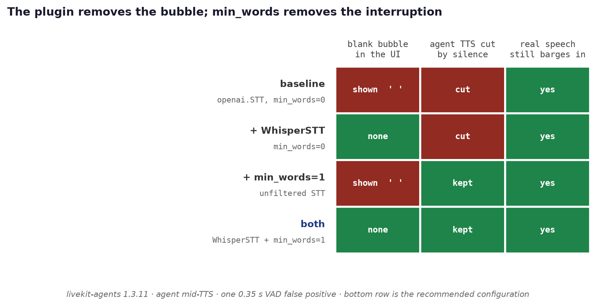
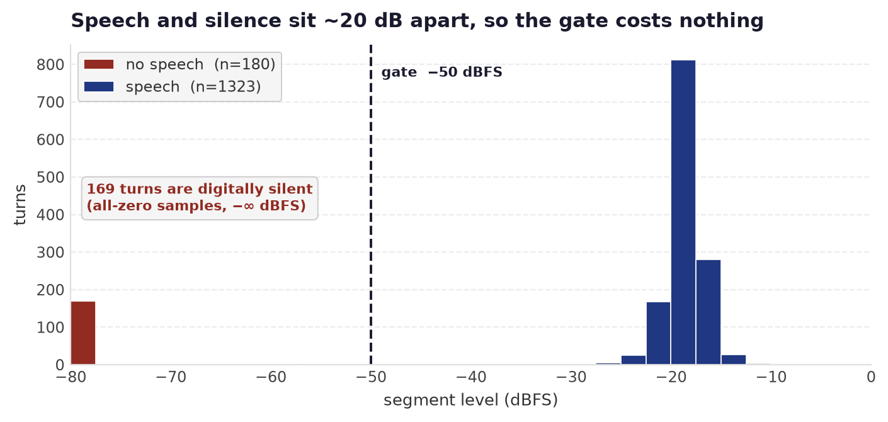
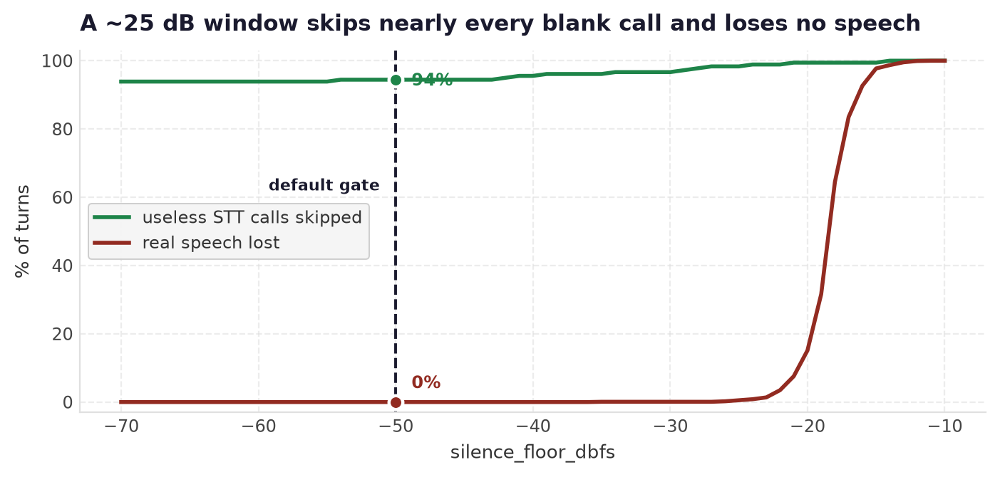
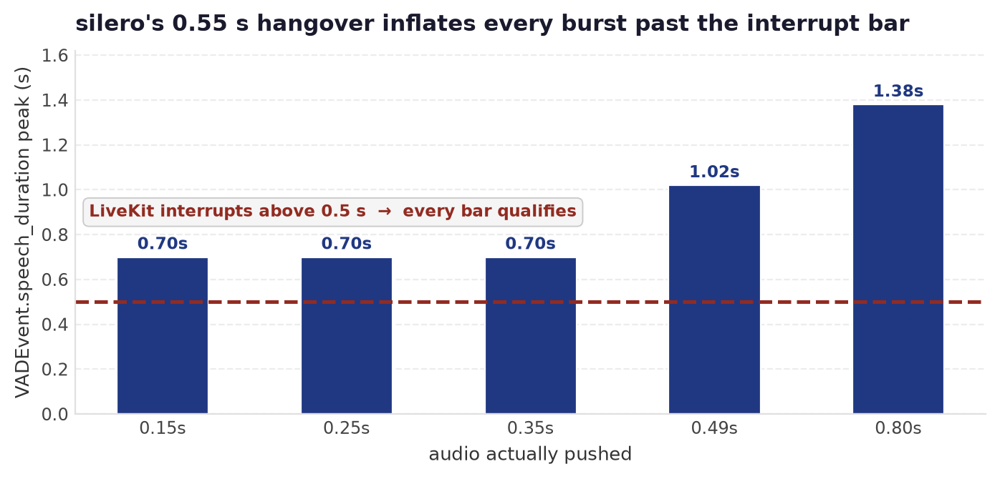

# Whisper STT for LiveKit Agents

An OpenAI-compatible Whisper client that **refuses to turn silence into an
interruption**, and doesn't pay for the request when the audio is obviously
empty.

```python
from livekit.plugins import silero
from stt_api.livekit_plugin.whisper_stt import WhisperSTT

session = AgentSession(
    stt=WhisperSTT(),          # reads STT_URL / STT_API / STT_MODEL from .env
    vad=silero.VAD.load(),     # required — this STT is not streaming
    llm=..., tts=...,
)
```

Keeping another provider? `DropBlankSTT` applies the same blank guard to
anything:

```python
from livekit.plugins import openai
stt = DropBlankSTT(openai.STT())     # same defect lives in that plugin
```



## Versions

Verified against **livekit-agents 1.3.11** (what `ucc_tm-voice-assist` pins) and
**1.8.2**. The plugin's own test suite passes on both. The defect and every
mechanism below are present in both; only the line numbers and the
`min_words` spelling differ.

| what | 1.3.11 | 1.8.2 |
|---|---|---|
| `if not transcript: return` | `audio_recognition.py:355` | `:1215` |
| `on_final_transcript(...)` | `audio_recognition.py:358` | `:1217` |
| `min_words` gate | `agent_activity.py:1174` | `:2325` |
| VAD-alone interrupt | `agent_activity.py:1243` | `:2447` |
| StreamAdapter guards | `stream_adapter.py:128,130` | `:147,149` |
| openai STT, **no guard** | `openai/stt.py:435` | `:652` |

## The bug

**Whisper answers silence with a single space, not an empty string.** Measured
against the production endpoint, all of these returned `' '` with HTTP 200:

| input | response |
|---|---|
| 2 s digital silence | `' '` |
| 0.5 s digital silence | `' '` |
| 2 s quiet room tone | `' '` |
| 2 s louder noise | `' '` |
| **0.10 s of real speech** | `' '` |

Across 1,503 real production turns, **180 (12 %)** came back as exactly `' '`.

A space is not empty, and LiveKit only checks emptiness:

```
stt/stream_adapter.py:149        elif not t_event.alternatives[0].text: continue
voice/audio_recognition.py:1215  if not transcript: return
voice/audio_recognition.py:1217  self._hooks.on_final_transcript(...)
voice/agent_activity.py:2531     -> self._interrupt_by_audio_activity()
```

`''` is falsy and stops at the guard. `' '` is truthy, passes both, and reaches
`on_final_transcript` — which calls `_interrupt_by_audio_activity()` **with no
text check of its own**. Verified by driving `AudioRecognition._on_stt_event`:

| STT returns | `on_final_transcript` fires | interrupts agent |
|---|---|---|
| `''` | no | **no** |
| `' '` | yes | **yes** |
| `'  \n\t'` | yes | **yes** |
| `'.'` | yes | **yes** |
| `'hello'` | yes | yes (correct) |

So the agent is cut off by silence, and nothing logs an error.

### Return empty text, never empty alternatives

`audio_recognition.py:1207` does `ev.alternatives[0].text` with **no length
check**. Returning `alternatives=[]` stops the interruption and introduces an
`IndexError`. This plugin always returns exactly one alternative carrying `""`,
which every guard in the chain tests correctly.

### Why `.strip()` and not a "has letters" test

Four turns in the production sample are real speech with **no ASCII
alphanumerics at all** — `' ஹலோ மாயா!'`, `' 你好,我想现在付款…'`. A
`[A-Za-z0-9]` filter would silently discard Tamil and Chinese callers.
`str.strip()` is Unicode-aware and does not.

Punctuation-only output (`'.'`) is treated as content, matching the
"strip, then check length" rule. It never occurred in the production sample; if
your traffic shows it, filter it explicitly rather than by character class.

## The second guard: skip the request entirely

A blank filter still pays for the round trip. A local check does not, and the
separation is not marginal — over 1,503 production turns:

| | RMS p05 | RMS median | RMS p95 |
|---|---:|---:|---:|
| speech turns (1,323) | −21.6 dBFS | −18.4 dBFS | −15.7 dBFS |
| non-speech turns (180) | — | **−240 dBFS** | −42.3 dBFS |

That median is not a typo: **169 of the 180 non-speech turns are literally all
zero samples**, every one exactly 0.30 s long.



| gate | useless calls skipped | real speech lost |
|---|---:|---:|
| `silence_floor_dbfs=-50` (default) | **170 / 180 (94.4 %)** | **0 / 1,323** |
| `silence_floor_dbfs=-40` | 172 / 180 (95.6 %) | 0 / 1,323 |
| duration < 0.50 s | 169 / 180 (93.9 %) | 0 / 1,323 |



`min_audio_duration` defaults to 0.1 s because 0.10 s of *real* speech also
transcribes to `' '` on this endpoint (0.15 s gives `' We'`), so anything
shorter cannot produce text.

### Those all-zero segments are not silero's doing

Fed 0.30 s of digital silence, silero peaks at p(speech) **0.0089** against its
0.5 activation threshold — it cannot be what emits them. Something upstream is
sending fixed 0.30 s zero buffers; a warmup or health probe against the STT
proxy would look exactly like this. The gate makes them free either way, but the
source is worth tracing rather than blaming the VAD.

## Configuration

Read from the process environment, falling back to the repo-root `.env`:

| variable | meaning |
|---|---|
| `STT_URL` | endpoint root, e.g. `https://host/proxy/stt` |
| `STT_API` | bearer token |
| `STT_MODEL` | model id **as the endpoint names it** |
| `STT_LANGUAGE` | optional hint (`ms`, `en`, `zh`, `ta`) |

A wrong `STT_MODEL` fails as a **404 with a model error**, not an auth error —
easy to misread as the endpoint being down. `GET {STT_URL}/v1/models` lists what
is actually served.

Everything is overridable per instance: `base_url`, `api_key`, `model`,
`language`, `prompt`, `temperature`, `min_audio_duration`, `silence_floor_dbfs`,
`timeout`, `http_session`.

## Observability

`stt.counters` tracks where segments went, which is the quickest way to confirm
the gate is doing what the numbers above predict:

```python
{'requests': 2, 'transcribed': 1, 'blank_responses': 1,
 'skipped_quiet': 3, 'skipped_short': 1, 'skipped': 4}
```

## What this does NOT fix: the VAD interrupts on its own

**Measured, and it corrects an earlier claim in this file.** In a real
in-process `AgentSession` with the agent mid-TTS, a 0.35 s VAD false positive cut
the agent's speech **even when this plugin returned `''`**:

| STT returns | `min_words` | agent was speaking | agent TTS cut |
|---|---:|---|---|
| `' '` (raw Whisper) | 0 (default) | yes | **yes** |
| `''` (this plugin) | 0 (default) | yes | **yes** |
| `' '` | 1 | yes | no |
| `''` | 1 | yes | no |

`_interrupt_source` was `audio_activity` in both default-config arms: the VAD had
already interrupted before the transcript mattered.

The reason is that `VADEvent.speech_duration` keeps accumulating through silero's
`min_silence_duration` hangover (0.55 s), so a burst far shorter than LiveKit's
0.5 s interrupt threshold still clears it:



| burst pushed | peak `speech_duration` | clears the 0.5 s bar? |
|---:|---:|---|
| 0.15 s | **0.70 s** | yes |
| 0.35 s | **0.70 s** | yes |
| 0.49 s | 1.02 s | yes |

So **every** VAD speech segment, however short, can interrupt by itself via
`agent_activity.py:2447`. An earlier version of this document claimed sub-0.5 s
segments could only interrupt through the STT path. That was wrong.

### What this plugin still buys you

Two things, neither of which is interruption (for that, see `min_words` below):

- **No chat bubble and no LLM context from silence.** A blank final transcript
  never reaches `on_final_transcript` (`audio_recognition.py:1215`), so no
  `user_input_transcribed` event fires and nothing is appended to the chat
  context. Whisper's `' '` does fire it.
- **~94 % fewer STT calls**, from the local RMS and duration gates.

### The interruption lever: `min_words`

`_interrupt_by_audio_activity()` has its own gate at `agent_activity.py:2325`
which applies to **both** the VAD and STT paths — but only when `min_words > 0`,
and it defaults to **0**:

```python
if self.stt is not None and interruption_options["min_words"] > 0 and ...:
    text = self._audio_recognition._current_transcript
    if len(split_words(text, split_character=True)) < interruption_options["min_words"]:
        return          # <- no interruption, whichever path called
```

Set it to 1. **The spelling depends on your livekit-agents version** — check
before copying:

```bash
python -c "import livekit.agents as a; print(a.__version__)"
```

**1.3.x / 1.6.x / 1.7.x** — `turn_handling` does not exist; passing it raises
`TypeError`:

```python
session = AgentSession(
    stt=WhisperSTT(),
    vad=silero.VAD.load(),
    llm=..., tts=...,
    min_interruption_words=1,        # default is 0
)
```

**1.8+** — the same keyword still works and is migrated internally, but is
deprecated in favour of:

```python
session = AgentSession(
    stt=WhisperSTT(),
    vad=silero.VAD.load(),
    llm=..., tts=...,
    turn_handling={"interruption": {"min_words": 1}},
)
```

Either form leaves the other interruption defaults intact (`min_duration` 0.5,
`false_interruption_timeout` 2.0, and so on).

The word split is Unicode-safe, which matters for this traffic:

| text | words |
|---|---:|
| `''`, `' '`, `'.'` | **0** — no interruption |
| `'hello'` | 1 |
| `' ஹலோ மாயா!'` | 2 |
| `' 你好,我想现在付款'` | 8 |

**Verified, including the control.** Measured end to end on livekit-agents
1.3.11 with the agent mid-TTS and a 0.35 s VAD false positive:

| setup | `min_words` | TTS cut | bubble fired | transcript shown |
|---|---:|---|---|---|
| unfiltered STT | 0 | yes | **1** | **`' '`** |
| **`WhisperSTT`** | 0 | yes | **0** | — |
| unfiltered STT | 1 | **no** | 1 | `' '` |
| **`WhisperSTT`** | 1 | **no** | **0** | — |
| unfiltered, **real speech** | 1 | **yes** | 1 | `'saya nak tanya'` |
| `WhisperSTT`, **real speech** | 1 | **yes** | 1 | `'saya nak tanya'` |

The last two rows are the control that matters: `min_words=1` still lets a
genuine utterance barge in, so it is not simply interruption switched off.
Raising it above 1 would start costing one-word barge-ins like "stop".

Read together: the plugin removes the blank bubble, `min_words=1` removes the
interruption, and you need both.

## Regenerating the figures

```bash
pip install matplotlib          # dev-only, not a dependency of this plugin
python -m stt_api.livekit_plugin.whisper_stt.plots
```

[`plots.py`](plots.py) reads the cached production corpus when one is present and
falls back to the recorded summary statistics otherwise. Style follows
`Whisper-Hallucination/bench/plot_benchmark.py` so figures read the same across
both repos.

## Runnable example

[`example_agent.py`](example_agent.py) wires exactly this, and picks the right
`min_words` spelling for the installed version at runtime:

```bash
export STT_URL=... STT_API=... STT_MODEL=...
python -m stt_api.livekit_plugin.whisper_stt.example_agent dev
```

## What this also does not fix

**Repeated `user_speaking` → `stt_request` pairs inside one turn.** Those are the
VAD segmenting a long turn: `StreamAdapter` calls `recognize()` once per speech
segment regardless of what comes back. The local gate makes ~94 % of them free,
but the segmentation itself is VAD tuning (`min_speech_duration`,
`activation_threshold`).
